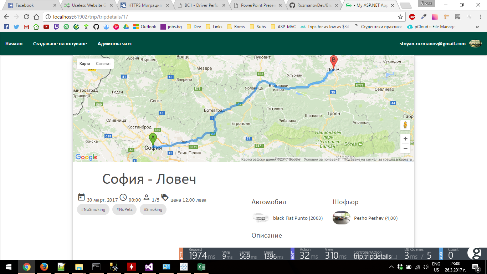
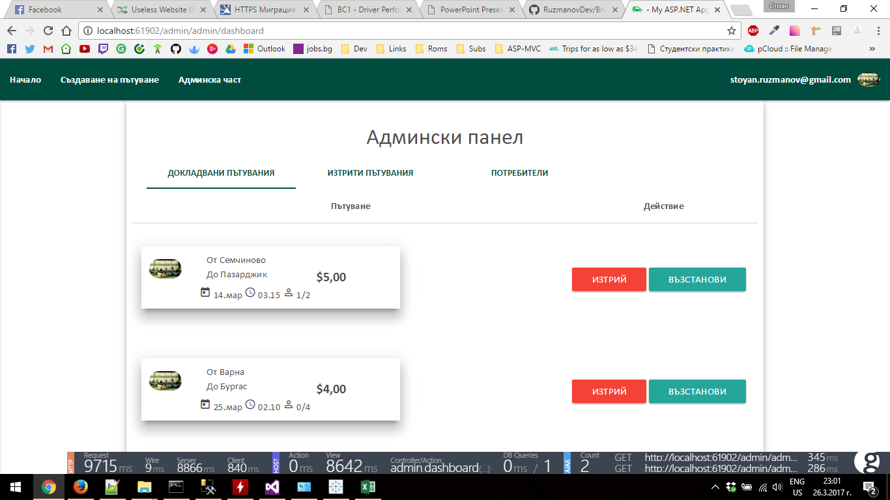

# BrumWithMe
## Online portal for shared travelling

# Basic Description
- Users posts a trip from city A to city B 
- Another user sends a request to join the trip
- The Driver(User that created the trip) can reject or accept the users

## Functionality
- Autocomlete on inputs (Get city names from the db)
- Latest trips section
- Trips can have tags (e.g. #nosmoking #pets etc.)
- User Dashboard(Info for trips created by them and/or requests for joining that they have sent)
- Drivers can recieve comments with rating
- Trips can be reported(The admin can delete them later)
- Users can upload their avatar

### Admin 
- Delete reported Trips
- Restore deleted Trips
- Bann users for time

# Used technologies
- Asp.NET MVC 5
- MSSQL Server
- EF
- jQuery
- materializecss

# Screenshots

|                                     |                                |
| ----------------------------------- |:------------------------------:|
|      | |
|      | |
|      | |
|      | |
